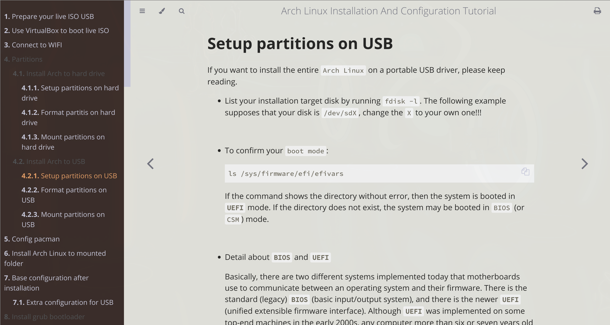
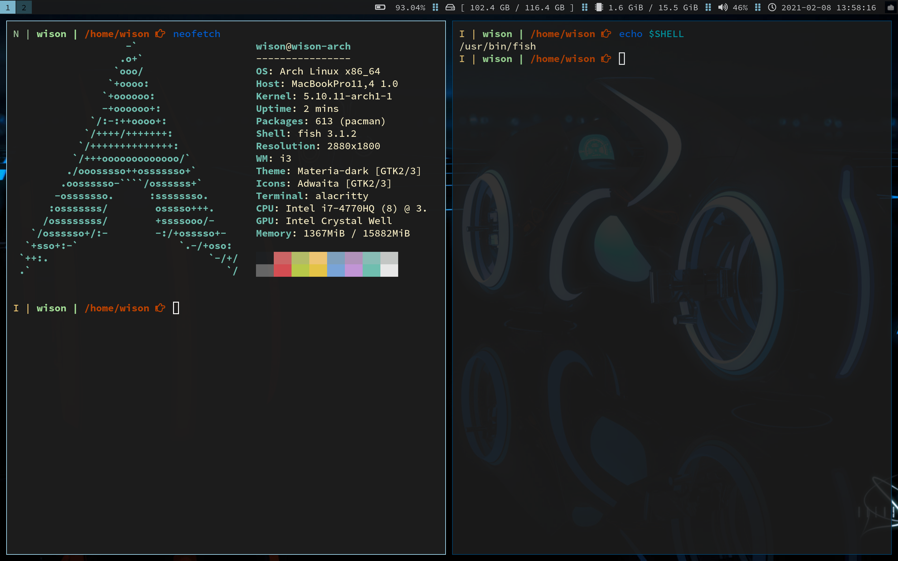
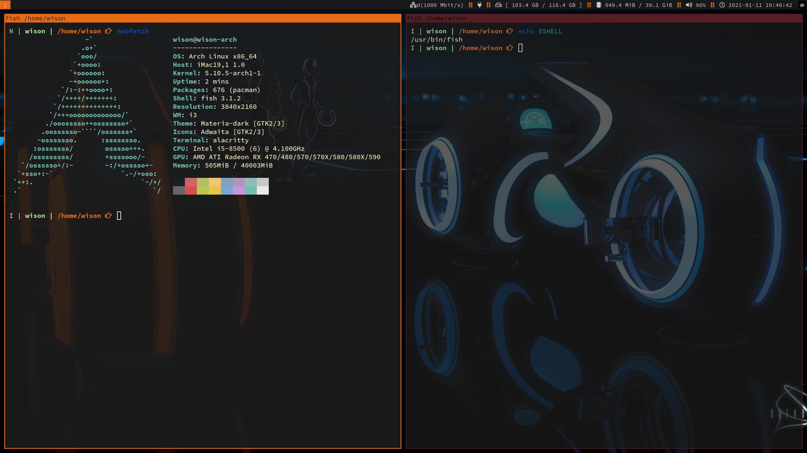
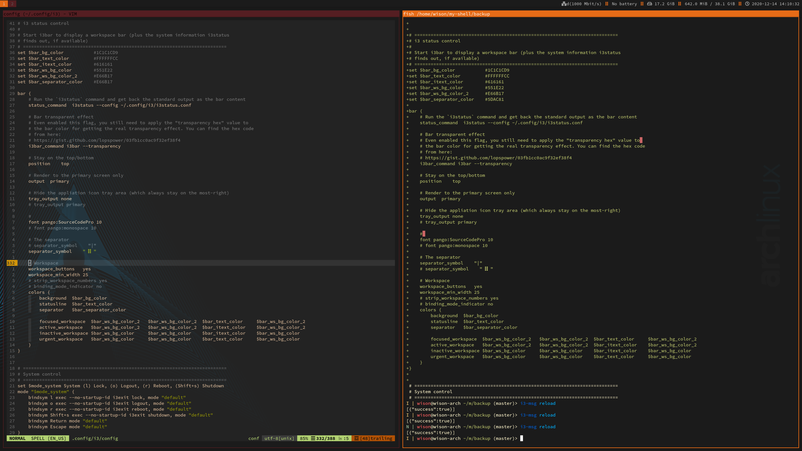

# Arch Linux Installation And Configuration Tutorial

## What's included in this book

This book includes everything you need to know about installing `Arch Linux` into the `USB`.
Here is the chapter list content:

- Prepare your live ISO USB
- Use `VirtualBox` to boot live ISO
- Connect to WIFI
- Partitions
    - Install Arch to hard drive
        - Setup partitions on hard drive
        - Format partitis on hard drive
        - Mount partitions on hard drive
    - Install Arch to USB
        - Setup partitions on USB
        - Format partitions on USB
        - Mount partitions on USB
- Config `pacman`
- Install Arch Linux to mounted folder
- Base configuration after installation
    - Extra configuration for USB
- Install `grub` bootloader
    - Install `grub` to hard drive
    - Install `grub` to USB
- Recommended package to install
- Finish installation
- Arch configuration guide
    - You should know about `Getty`
    - Prepare your preferred editor Configuration
    - WIFI Configuration
    - Make your boot faster
    - Install or update kernel
    - Install `yay` to enable `AUR`
    - Install `X` implementation
    - Install `lightdm`
    - Fix resolution issue
    - Install `GTK` themes
    - Install browser
        - Install `Chrome`
        - `vim` plugins
        - Install `ungoogled-chromium`
    - Install `i3` Window Manager
    - i3_customization
        - Change wallpaper
        - Icon font support
        - Window customization
        - Bar customization
        - Bar customization with `i3blocks`
        - Bar customization with `polybar`
        - Multiscreen lock
        - Change unlock timeout
        - `i3` config sample
        - Notification
        - Notification config sample
        - Low-battery notification
        - Fast open windows
    - Special keybinding
        - Advanced keybinding
        - Switching keyboard
    - Install `NerdFont`
    - Install `Ranger`
    - `neovim`
    - `lookatme`
    - About GPU
    - Fix sound issue
    - Fix webcam issues
    - Support chinese
    - Install `docker`
    - Screen recording
    - Running `wechat` in docker
    - Use Wechat in Wine
    - Install communication tools
        - Install `zoom`
        - Install `slack`
    - About cleaning cache
    - Backup and restore
    - Firewall
    - Mac extra configuration
        - Change `DPI` by script
        - brightness control
        - Trackpad support
        - Bluetooth support
        - Access `Apple File System`

</br>



## How to run

The book is created by **`mdbook`**.

- How to install **`mdBook`**

    Install via cargo:

    ```bash
    cargo install mdBook
    ```

- How to view the book in your browser

  Make sure you're in the repo root folder and run:

    ```bash
    # Clean the prev build
    mdbook clean installation-tutorial-book

    # Serve it via HTTP server
    mdbook serve --open installation-tutorial-book
    ```
It will build the book into `installation-tutorial-book/book` 
folder and open it your browser.

How to export the book into **`PDF`** format?

That's pretty easy, in the browser, click on the print icon on the right-top to save as **`PDF`**.

</br>

### `i3` customization UI preview:


[Full size preview](https://github.com/wisonye/arch-linux/blob/master/installation-tutorial-book/src/images/preview-4.png)



[Full size preview](https://github.com/wisonye/arch-linux/blob/master/installation-tutorial-book/src/images/preview-tron-1.png)



[Full size preview](https://github.com/wisonye/arch-linux/blob/master/installation-tutorial-book/src/images/preview-5.png)



[Full size preview](https://github.com/wisonye/arch-linux/blob/master/installation-tutorial-book/src/images/preview-1.png)
