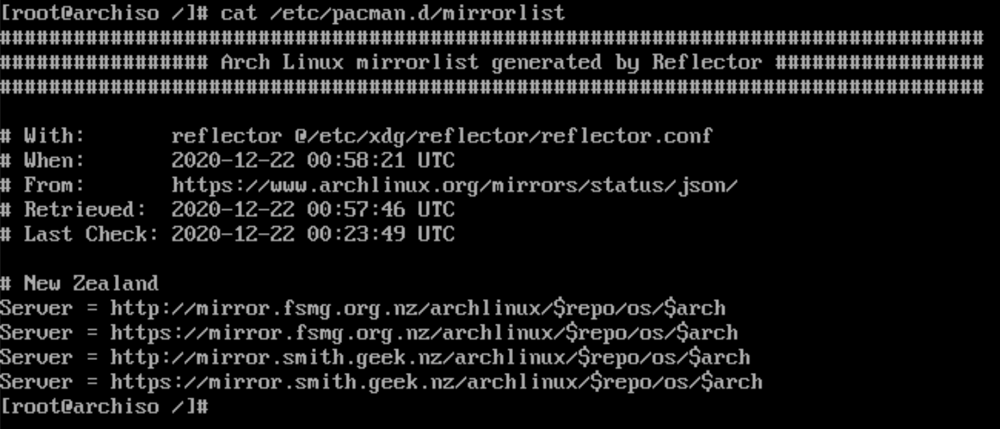
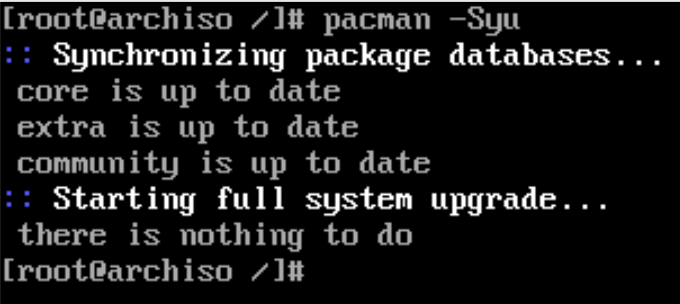
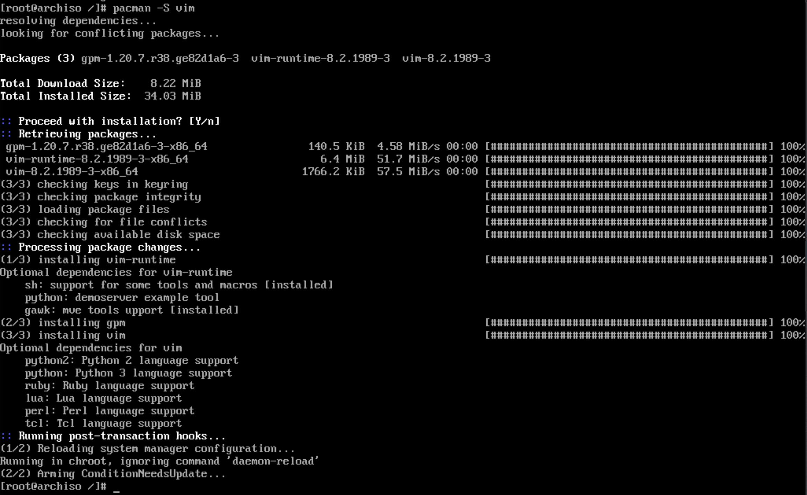
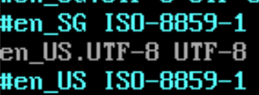
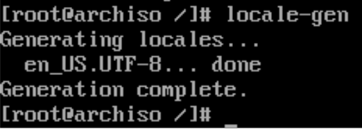
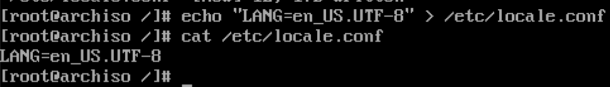

# Base configuration after installation

Keep in mind that:

The current `Arch Linux` you've already login is boot from the `Live ISO`, 
it just a `tool` for you to install another brand new `Arch Linux` to your hard drive or USB which located at `/mnt` and `/mnt/boot`.

Right now, you need to config the newer `Arch Linux` you just installed, that's why you need to use `arch-chroot` to change linux root environment into the `/mnt` folder!!!

After running `arch-chroot` command, you will be inside the newly installed `Arch Linux`.

</br>

- Change root into the new `Arch Linux`

    ```bash
    arch-chroot /mnt
    ```

</br>

- Choose timezone

    ```bash
    # ln -sf /usr/share/zoneinfo/YOUR_REGION/YOUR_CITY /etc/localtime
    # For example:
    ln -sf /usr/share/zoneinfo/Pacific/Auckland /etc/localtime
    ```

</br>

- Generate `/etc/adjtime`

    ```bash
    hwclock --systohc
    ```

</br>

- Sync **`pacman`** and install `vim`

    Before we continue, we need to install `vim` for the newer installed `Arch Linux`, then we can edit any configuration file.

    In the newer installed `Arch Linux`, the `/etc/pacman.d/mirrorlist` should be copied from the `Live Arch`, we can confirm that by running:

    ```bash
    cat /etc/pacman.d/mirrorlist
    ```

    

    </br>

    Then sync the `pacman` database and make sure it's up-to-date:


    

    </br>

    Then, let's do `pacman -S vim`:

    

    </br>

    Enable the `color`:

    ```
    vim /etc/pacman.conf
    # Search and enable `Color` line, save and exit
    ```

</br>

- Localization

    `vim /etc/locale.gen` and uncomment `en_US.UTF-8 UTF-8` line  and other needed `locales`.

    

    </br>

    Then, genereate the locale settings:

    ```bash
    locale-gen
    ```

    

    </br>


    `echo "LANG=en_US.UTF-8" > /etc/locale.conf`:

    

    </br>


    `vim /etc/vconsole.conf` and add your custom keybinding (if needed):

    ```bash
    # Add my custom settings below (`Caps_Lock` works like `Escape`) to
    # `/etc/vconsole.conf`.
    # Save and exit.
    KEYMAP=us
    keycode 9 = Escape
    keycode 66 = Escape
    ```

    Change to `KEYMAP=colemak` if you use `colemak` keyboard layout!!!

</br>

- Hostname and host settings
    - `vim /etc/hostname`, set to your hostname.

    - `vim /etc/hosts` with the base settings like below:

        ```
        127.0.0.1	localhost
        ::1		localhost
        127.0.1.1	YOUR_HOSTNAME_HERE.localdomain	YOUR_HOSTNAME_HERE
        ```

</br>

- Set root password

    ```bash
    passwd
    ```
