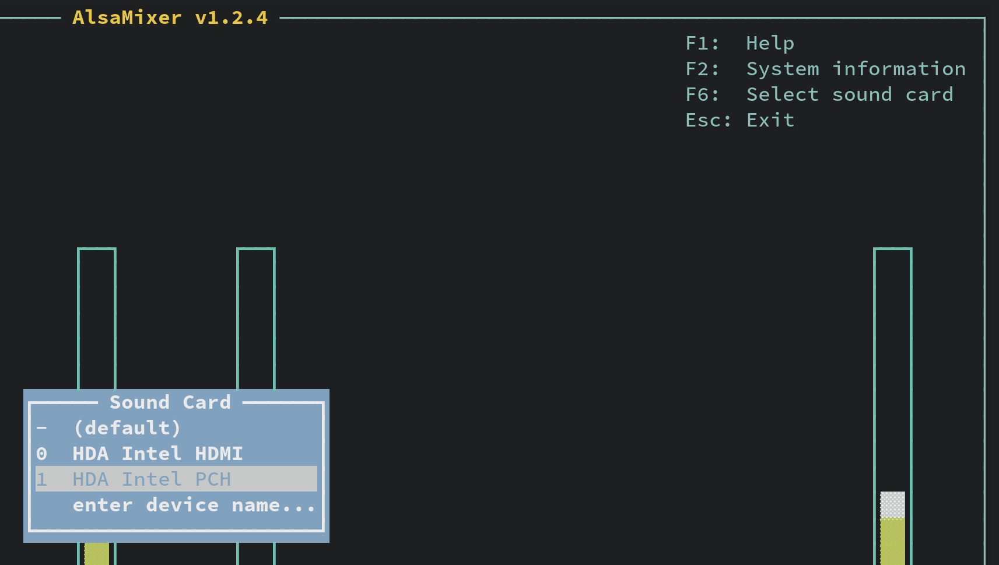
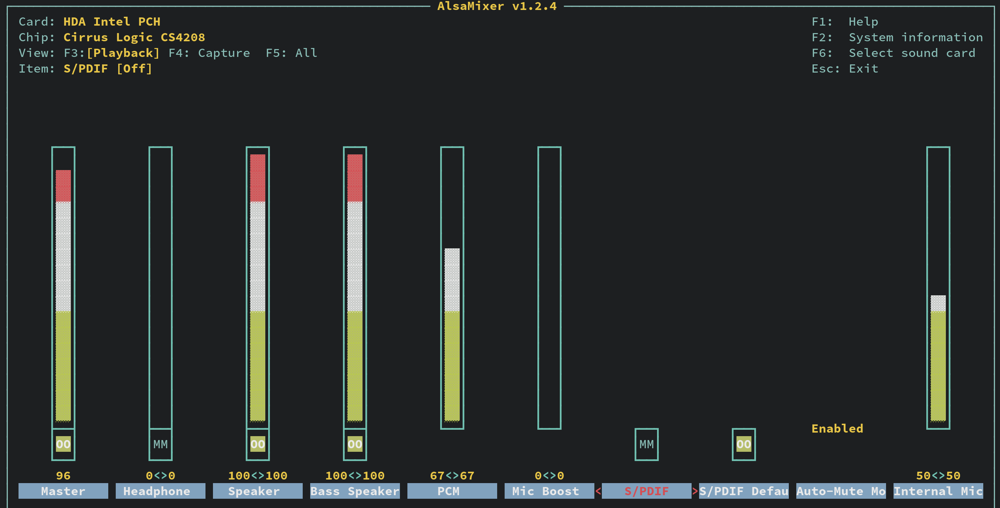
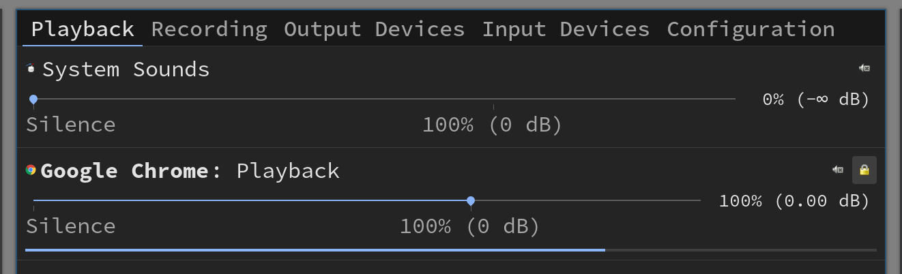

# Fix sound issue

- Install the packages below:

    ```bash
    sudo pacman -Sy pulseaudio alsa-utils

    # Reboot
    ```

- Run `alsamixer` and tune your sound setting

    - Press `F6` to choose your major audio playback device:

        

    - After selecting your correct audio playback device, 
    press `F3` to setup the `Playback` volume. Use left/right arrow key 
    to switch item and use Up/Down arrow key to change the volume. 

        


- Optionally, you can install **`pavucontrol`** GUI volume control app

    ```bash
    sudo pacman -Sy pavucontrol
    ```

    It looks like this:


    

