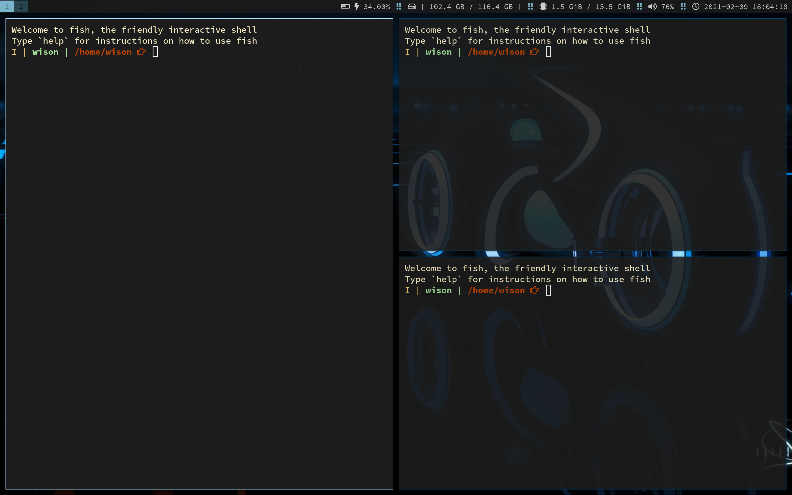

# How to open multiple window in the particular layout

You can run `i3-msg` command in terminal, it's the same way you call command
in the `i3` config file.

Let's use terminal script to open multiple windows in the particular layout:)

</br>

- Write some scripts to run `i3-msg` to open windows and change layout

    - `vim ~/scripts/2w.sh` with the following contents:

        ```bash
        #!/usr/bin/fish
        
        # Open 2 windows in the particular layout below:
        #  --------   -------- 
        # |        | |        |
        # |        | |        |
        # |        | |        |
        # |        | |        |
        # |        | |        |
        # |        | |        |
        #  --------   -------- 
        
        i3-msg --quiet --type command "split horizontal; exec alacritty; exec alacritty" &
        
        # The `sleep` call here is important, as the `i3-msg` needs a bit of time to execute
        # before the layout gets changed!!!
        sleep 0.2 
        
        i3-msg --quiet --type command "focus left" &
        ```
        </br>

    - `vim ~/scripts/3w.sh` with the following contents:

        ```bash
        #!/usr/bin/fish
        
        # Open 3 windows in the particular layout below:
        #  --------   -------- 
        # |        | |        |
        # |        | |        |
        # |        |  -------- 
        # |        |  -------- 
        # |        | |        |
        # |        | |        |
        #  --------   -------- 
        
        i3-msg --quiet --type command "split horizontal; exec alacritty; exec alacritty" &
        
        # The `sleep` call here is important, as the `i3-msg` needs a bit of time to execute
        # before the layout gets changed!!!
        sleep 0.2 
        
        i3-msg --quiet --type command "split vertical; exec alacritty" &
        
        sleep 0.1
        
        i3-msg --quiet --type command "focus left" &
        ``

</br>

- Map the key binding to run the scripts created above

    `vim ~/.config/i3/config` with the following settings:

    ```bash
    # Open window Mode: Open specified layout of windows based on the number
    mode "Open multiple windows in the specific layout" {
            # Pressing left will shrink the window’s width.
            # Pressing right will grow the window’s width.
            # Pressing up will shrink the window’s height.
            # Pressing down will grow the window’s height.
            # bindsym $left       resize shrink width $resize_unit px or $resize_unit ppt
            # bindsym $down       resize grow height $resize_unit px or $resize_unit ppt 
            # bindsym $up         resize shrink height $resize_unit px or $resize_unit ppt
            # bindsym $right      resize grow width $resize_unit px or $resize_unit ppt
            bindsym 2  exec ~/scripts/2w.sh; mode "default"
            bindsym 3  exec ~/scripts/3w.sh; mode "default"
    
            # back to normal: Enter or Escape
            bindsym Return mode "default"
            bindsym Escape mode "default"
    }
    bindsym Shift+$mod+o mode "Open multiple windows in the specific layout"
    ```

    Run `i3-msg reload` to reload.

</br>

- Test it

   Go to any `i3` workspace and press `Shift+$mod+o`, then you can see the tips below 
   to show on left-top area which is saying that you're in the particular mode at this moment:

   ```bash
   Open multiple windows in the specific layout
   ```

   And press `3`, then 3 windows should open like this:

   

</br>

