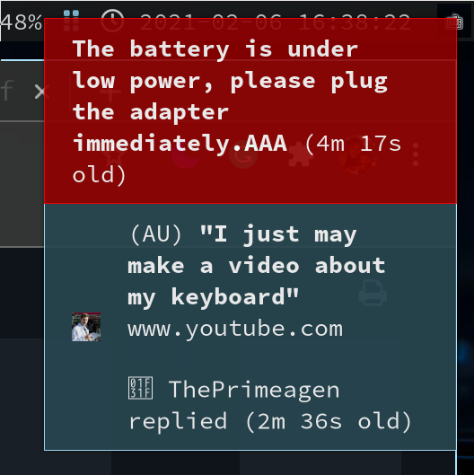
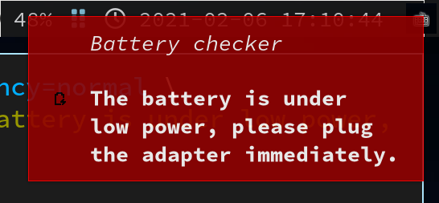

# Notification

Preview:





**`Desktop Notification`** allows user send custom notifcation to the **`DE/WM`**. It needs
two parts:

- Notifcation Server

    **`dunst`** is a customizable and lightweight notification-daemon.

    ```bash
    sudo pacman --sync --refresh dunst libnotify
    ```

- Notifcation client (program)

    **`notify-send`** is a built-in program to send desktop notifications.

</br>

### Custom configiration

- Copy the template to your home folder like below:

    ```bash
    cp -rvf /usr/share/dunst ~/.config
    ```

    </br>

- Lanuch it in `i3` session

    `vim ~/.config/i3/config` with the following settings:

    ```bash
    # Enable notification server
    exec --no-startup-id dunst
    ```

    </br>

- Here is the `~/.config/dunst/dunstrc` sample with comment

    You need to kill the exists process and restart **`i3`** like below to take
    effect after changing this file.

    ```bash
    killall dunst && i3-msg restart
    ```

    </br>

    ```bash
    # The geometry of the window:
    #   [{width}]x{height}[+/-{x}+/-{y}]
    # The geometry of the message window.
    # The height is measured in number of notifications everything else
    # in pixels.  If the width is omitted but the height is given
    # ("-geometry x2"), the message window expands over the whole screen
    # (dmenu-like).  If width is 0, the window expands to the longest
    # message displayed.  A positive x is measured from the left, a
    # negative from the right side of the screen.  Y is measured from
    # the top and down respectively.
    # The width can be negative.  In this case the actual width is the
    # screen width minus the width defined in within the geometry option.
    geometry = "500x5-20+20"

    # Show how many messages are currently hidden (because of geometry).
    indicate_hidden = yes

    # Shrink window if it's smaller than the width.  Will be ignored if
    # width is 0.
    shrink = true

    # The transparency of the window.  Range: [0; 100].
    # This option will only work if a compositing window manager is
    # present (e.g. xcompmgr, compiz, etc.).
    transparency = 10

    # Padding between text and separator.
    padding = 15

    # Horizontal padding.
    horizontal_padding = 30

    # The height of the entire notification.  If the height is smaller
    # than the font height and padding combined, it will be raised
    # to the font height and padding.
    notification_height = 0

    # Draw a line of "separator_height" pixel height between two
    # notifications.
    # Set to 0 to disable.
    separator_height = 1

    # Padding between text and separator.
    padding = 15

    # Horizontal padding.
    horizontal_padding = 30

    # Defines width in pixels of frame around the notification window.
    # Set to 0 to disable.
    frame_width = 1

    # Defines color of the frame around the notification window.
    frame_color = "#ACE6FE"

    # Font settings
    font = SourceCodePro 10

    # The spacing between lines.  If the height is smaller than the
    # font height, it will get raised to the font height.
    line_height = 0

    # Browser for opening urls in context menu.
    browser = /usr/bin/google-chrome-stable

    # Paths to default icons.
    # Icons are set in the option icon_path. Status and devices icons are needed. 
    # By default, Dunst looks for the `gnome-icon-theme` icons. For example, to use 
    # `adwaita-icon-theme` (gnome-icon-theme's successor), instead:
    icon_path = /usr/share/icons/Adwaita/16x16/status/:/usr/share/icons/Adwaita/16x16/devices/
    ```

</br>

- Test the notification:

    - Use `notify-send`:

        ```bash
        # Low  urgency level
        notify-send --urgency=low \
            "The battery is under low power, please plug the adapter immediately."

        # Normal urgency level
        notify-send "The battery is under low power, please plug the adapter immediately."
        notify-send --urgency=normal \
            "The battery is under low power, please plug the adapter immediately."

        # Critical urgency level
        notify-send --urgency=critical \
            "The battery is under low power, please plug the adapter immediately."

        # Use icon
        notify-send  --icon=battery-level-0-charging-symbolic.symbolic \
            "The battery is under low power, please plug the adapter immediately."
        ```

    - Use `dunstify`:

        ```bash
        dunstify --appname="Battery checker" \
                 --urgency=critical --icon=battery-level-0-charging-symbolic.symbolic \
                 "The battery is under low power, please plug the adapter immediately."
        ```
