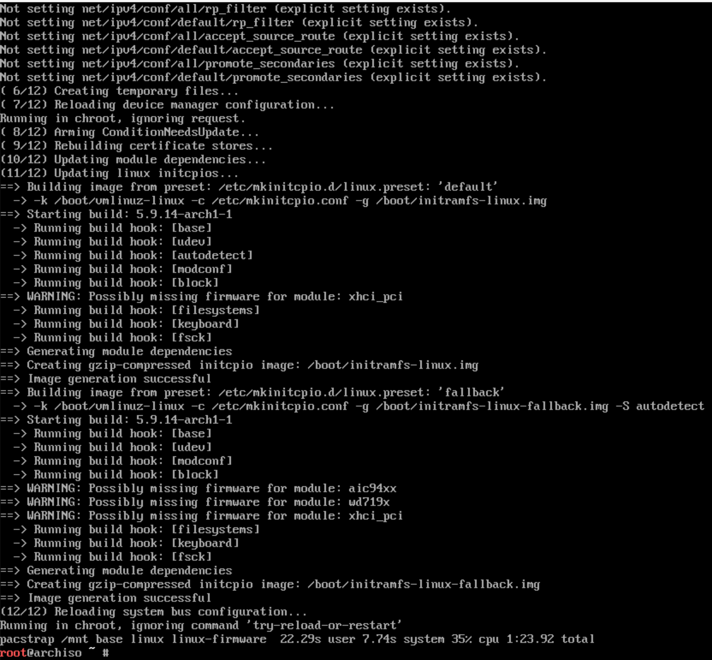
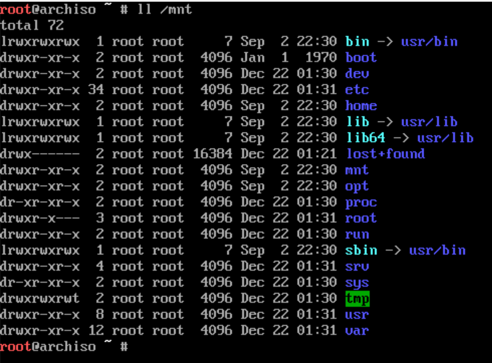
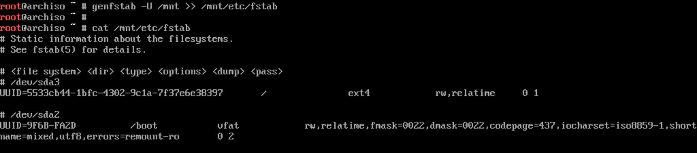

# Install Arch Linux to mounted folder

Keep in mind that:

The current `Arch Linux` you've already login is boot from the `Live ISO`, 
it just a `tool` for you to install another brand new `Arch Linux` to your hard drive or USB which located at `/mnt` and `/mnt/boot`.

That means there will be an entirely brand new `Arch Linux` in your `/mnt` folder!!!

Now, use the `pacstrap(8)` script to install the base package, Linux kernel and firmware for common hardware:

```
# `/mnt` is where all packages will be installed to!!!
pacstrap /mnt base linux linux-firmware
```





</br>

After that, generate the `fstab` file, the `-U` flag means use **UUID** to identify the device. 

As if you're installing to the USB, then the USB will be plugged into a different machine which causes different `/dev/XXX` labels.

```bash
genfstab -U /mnt >> /mnt/etc/fstab
```


