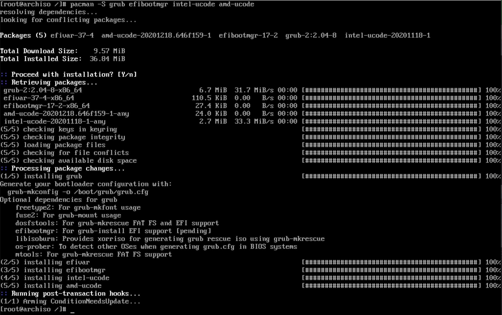
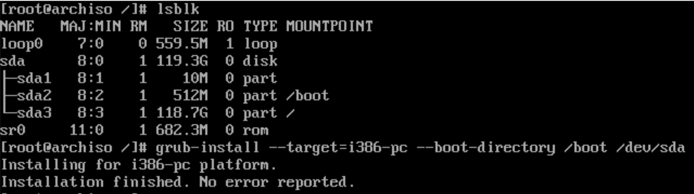
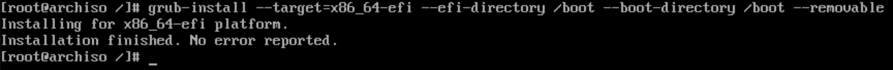
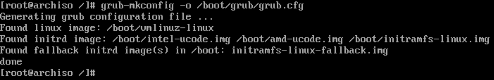
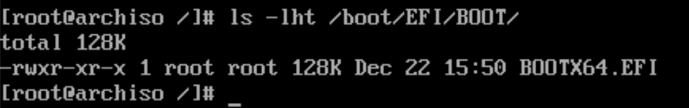
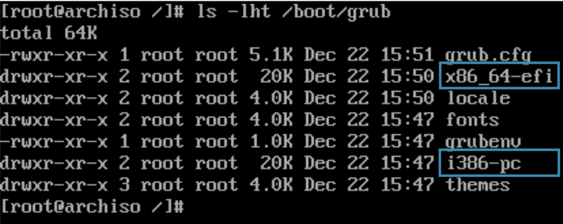

# Install **`grub`** to USB

Make sure you're in the `New Arch Linux` root environment. If not, please run `arch-chroot /mnt` to go inside it.

To enable booting the USB in both modes (**`BIOS`**, **`UEFI`**), two bootloaders will need to be installed.

- Install the following packages:

    ```bash
    # `intel-ucode` and ` amd-ucode ` is for the bootloader to know Intel CPU
    # architecture, you need to change to your CPU one.
    #
    # As we install to USB, then  we needs to have `microcode` for both 
    # manufacturer processors
    #
    # Optionally, you can install `os-prober` if you want `grub` to detect exists OS.
    # For example, you want `grub` to handle multi OS boot situation.
    pacman -S grub efibootmgr intel-ucode amd-ucode
    ```

    

</br>

- Setup **`bootloader`**:

    -  View the current block devices to determine the target USB device:

        ```bash
        lsblk
        ```

        Make sure that `/dev/sdX` block device is the USB you're installing to !!!

        All the command below, the `/dev/sdX` below means the USB driver itself, not to any partition. So please DO NOT add any number at the end!!!

        ```bash
        # `/dev/sdX` is correct
        # `/dev/sdXn` is NOT correct
        ```

    </br>

    - Setup **`GRUB`** for **`MBR/BIOS`** booting mode (replace the `X` to your real device letter)
        
        ```bash
        grub-install --target=i386-pc --boot-directory /boot /dev/sdX
        ```

        

    </br>

    - Setup **`GRUB`** for **`UEFI`** booting mode

        ```bash
        # Install CPU specified `grub`, you can run `uname -m` to confirm your CPU architecture.
        # Install `x86_64` architecture and `EFI`.
        grub-install --target=x86_64-efi --efi-directory /boot --boot-directory /boot --removable
        ```

        

    </br>

    - Generate a **`GRUB`** configuration:

        ```bash
        grub-mkconfig -o /boot/grub/grub.cfg

        # After that, it will generate something important below:
        # /boot/EFI/BOOT/BOOTX64.EFI
        # /boot/grub/x86_64-efi/
        # /boot/grub/i386-pc/
        ```

        

        

        
