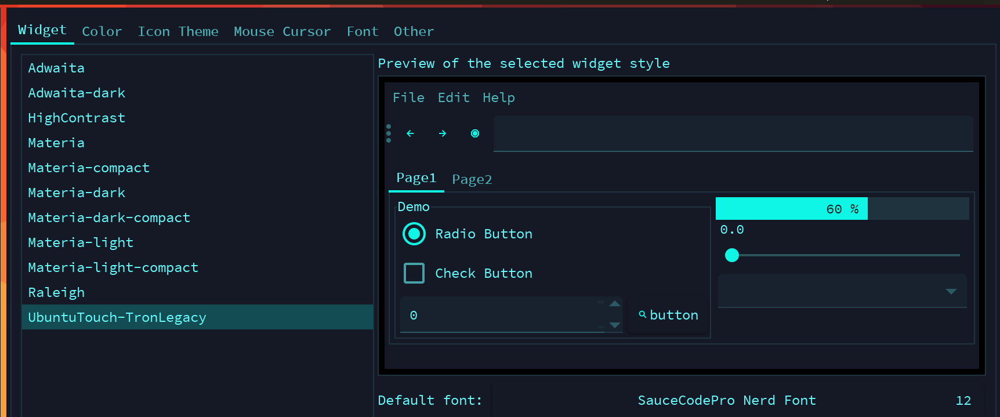

# Install GTK themes

After installing `X` implementation, it's optional to install different `GTK themes`.
Those themes can make the GUI application looks more nice.

**`GTK`** (The GIMP Toolkit) was initially made by the **`GNU`** Project for GIMP, 
but it is now a very popular toolkit with bindings for many languages.

- Install themes and configuration tools

    ```bash
    sudo pacman -Sy lxappearance materia-gtk-theme qt5ct
    ```

    After installing, all the themes are located in `/usr/share/themes/`

</br>

- Run the configuration tool to pick the theme you like

    - For GTK

        ```bash
        lxappearance

        ```

        

        The `Materia-dark` + `Source Code Pro` font would be a nice chocie.

        You can find more GTK themes at [here](https://wiki.archlinux.org/index.php/GTK).

        </br>

        After changing, it saves to one of the following files:

        ```bash
        #GTK 2 user specific
        ~/.gtkrc-2.0

        # GTK 2 system wide
        /etc/gtk-2.0/gtkrc

        # GTK 3 user specific
        $XDG_CONFIG_HOME/gtk-3.0/settings.ini
        # or if $XDG_CONFIG_HOME is not set
        $HOME/.config/gtk-3.0/settings.ini 

        # GTK 3 system wide
        /etc/gtk-3.0/settings.ini
        ```

        </br>

    - For QT

        ```bash
        qt5ct
        ```

        After changing, it saves to:

        ```bash
        /home/wison/.config/qt5ct/qt5ct.conf
        ```

        </br>

- Install extra themes

    - Download theme and `unzip` or `tar -xzf`.

    - Then move the extracted folder to `/usr/share/themes`

    - Open `lxappearance` and select the theme.

    </br>

- Install extra icon themes

    - Download icon theme and `unzip` or `tar -xzf`.

    - Then move the extracted folder containing the icons to either `~/.icons` 
    or `~/.local/share/icons` (user only) or to `/usr/share/icons` (systemwide).

    - Optional: run `gtk-update-icon-cache -f -t ~/.icons/<theme_folder>` to
    update the icon cache.
    
    Then you can select the icon theme in `lxappearance`.

    </br>


