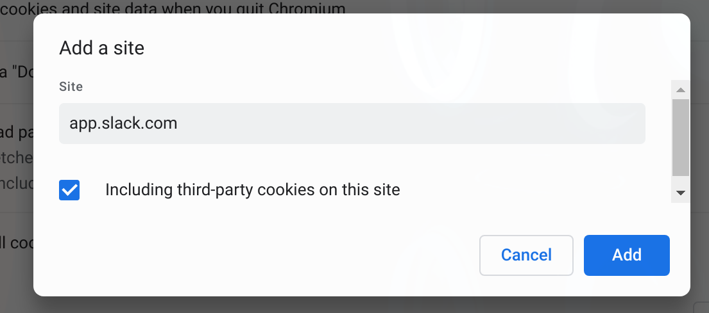

# Install slack

- Install

    ```bash
    yay -S slack-desktop
    ```

</br>

- Change default browser to login

    As `slack` use `chromium` as login browser by default. So, if you don't use
    `chromium`, then you should let `slack` knows that which browser you're using:

    For example, suppose that you're using `ungoogled-chromium`:

    - `sudo vim /usr/share/applications/slack.desktop` with the following settings:
        
        ```bash
        Exec=env BROWSER=ungoogled-chromium /usr/bin/slack -s %U
        ```

        </br>

    - Add environment when you want to open `slack`:

        ```bash
        BROWSER=/usr/bin/ungoogled-chromium slack &
        ```

        </br>

    Or you can run `ps ax | grep chromium` or `procs chromium` to show the login URL
    like below:

    ```bash
    12582 /usr/bin/ungoogled-chromium https://app.slack.com/ssb/signin?ssb_vid=5fxm1d0cfutcmhmqz34obhdxi&ssb_instance
    ```

    Then you can click on that link or copy it and open into your browser to continue
    the login process!!!

    If you're using `ungoogled-chromium` and you see the error like below when you login:

    
    
    Then follow the steps below to solve that:

    - Open `ungoogled-chromium` cookie setting by accessing `chrome://settings/cookies`

    - Click `Add` button to allow the particular website to always use cookies:
        
        

    - Add `app.slack.com` and make sure click the checkbox:

        

    </br>

    Then, run `BROWSER=/usr/bin/ungoogled-chromium slack &` again to login.

    But sometimes, even you login successfully, a couple of browser login processes still running
    in the background (and you can see your CPU 100% if you run `htop`). If that's the case, you
    have to kill all browser login processes:

    ```bash
    # Change the `ungoogled-chromium` to the browser instance you see in `ps` or `procs` or `htop`
    killall ungoogled-chromium
    ```

</br>


</br>

