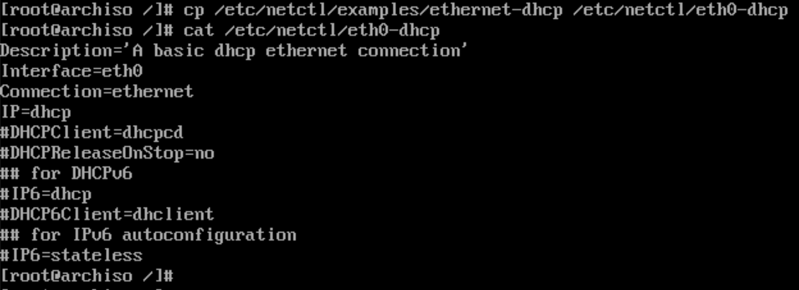
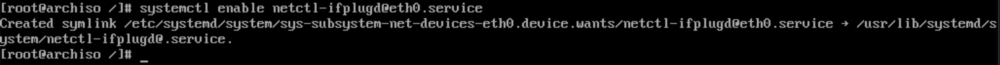
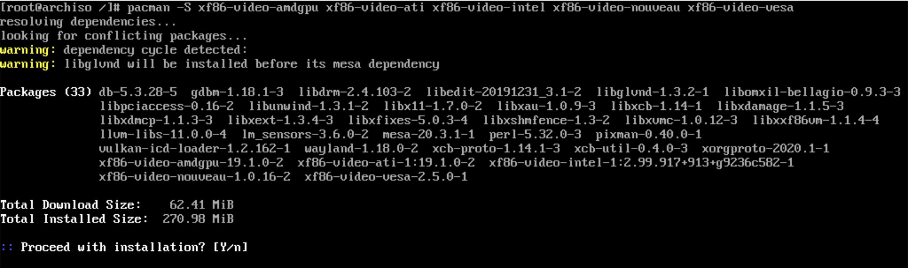

# Recommended package to install

All the packages below are optional but recommended which can make your life a bit easier before you install any DE (**`Desktop Environment`**) or WM (**`Window Manager`**).

Make sure you're in the `New Arch Linux` root environment. If not, please run `arch-chroot /mnt` to go inside it.

- Networking

    - [`netctl`](https://wiki.archlinux.org/index.php/netctl) - A CLI and profile-based network manager.
    - `ifplugd` - a daemon which will automatically configure your Ethernet device when a cable is plugged in and automatically unconfigure it if the cable is pulled.
    - And the based WIFI support CLI.

    ```bash
    pacman -S netctl ifplugd iw wpa_supplicant dhcpcd
    ```

    Copy the example ethernet profile to `/etc/netctl/`:

    ```bash
    cp /etc/netctl/examples/ethernet-dhcp /etc/netctl/eth0-dhcp
    ```

    

    Enable `ifplugd` to automatically connect to any available wired network:

    ```bash
    systemctl enable netctl-ifplugd@eth0.service
    ```

    

    Enable network time synchronization:
    ```bash
    systemctl enable systemd-timesyncd.service

    # You can check you time setting by command `timedatectl`
    timedatectl
    #    Local time: Wed 2014-09-24 21:19:26 CST
    #  Universal time: Wed 2014-09-24 13:19:26 UTC
    #        RTC time: Wed 2014-09-24 13:19:26
    #        Timezone: Asia/Shanghai (CST, +0800) // time zone you setted
    #     NTP enabled: yes // if you enable systemd-timesysncd success here will be yes, otherwise you need use `systemctl status systemd-timesyncd.service` to check it
    #NTP synchronized: yes
    # RTC in local TZ: no
    #      DST active: n/a
    ```


    For the `WIFI` configuration, please go to `Configuration` chapter.

    </br>

- Video drivers

    To support most common **`GPUs`**, install all five basic open source video drivers:

    ```bash
    pacman -S xf86-video-amdgpu xf86-video-ati xf86-video-intel xf86-video-nouveau xf86-video-vesa
    ```

    

    </br>

- Touchpad support

    Install support for standard notebook touchpads:

    ```bash
    pacman -S xf86-input-synaptics
    ```

    </br>

- Battery support

    Install support for checking battery charge and state:

    ```bash
    pacman -S acpi tlp
    ```

    Enable the service

    ```bash
    systemctl enable tlp.service
    ```

    </br>

- Build tools and `git` if you needed

    ```bash
    pacman -S base-devel man
    ```

    Set git global config

    ```bash
    git config --global user.name "YOUR_FULL_NAME_HERE"
    git config --global user.email "YOUR_EMAIL_HERE"
    ```

    </br>

- Basic editor and shell if you needed

    ```bash
    pacman -S neovim python-pynvim fish
    ```

    </br>

- Basic ssh tool if you needed

    ```bash
    pacman -S openssh
    ```

    </br>

- `bat` is a enhancement for `cat` written in `Rust`.

    It adds some default features below:

    - Line number
    - Color
    - Git integration, can show git status
    - Works like `less` you can do `vim` searching
    - Automatic paging

    ```bash
    pacman --sync --refresh bat
    ```

    usage:

    ```bash
    bat FILE_NAME

    # Pipe case
    curl -s https://sh.rustup.rs | bat
    ```

    </br>

- `rg` is a replacement for `grep` written in `Rust`.

    ```bash
    pacman --sync --refresh ripgrep
    ```

    </br>

- `xlock` for the screen lock

    ```bash
    pacman --sync --refresh xlockmore
    ```

    </br>

- `procs` is a replacement for `ps` written in `Rust`.

    ```bash
    pacman --sync --refresh procs
    ```

    Optionally, you can add `alias ps="procs"` (for `bash`) or `abbr ps "pros" (for `fish`)
    to your shell configuration file.

    Some use cases:

    ```bash
    # Query `vim` related process
    procs vim

    # Query `vim` or `alacritty` related process
    procs --or vim alacritty

    # Query `vim` or `alacritty` and ascending sort by PID
    procs --or --sorta PID vim alacritty

    # Query `vim` or `alacritty` and descending sort by memory
    procs --or --sortd VmRss vim alacritty

    # Query `vim` or `alacritty` related process in watch mode (1s refresh rate)
    procs --or --watch vim alacritty
    ```

    </br>

