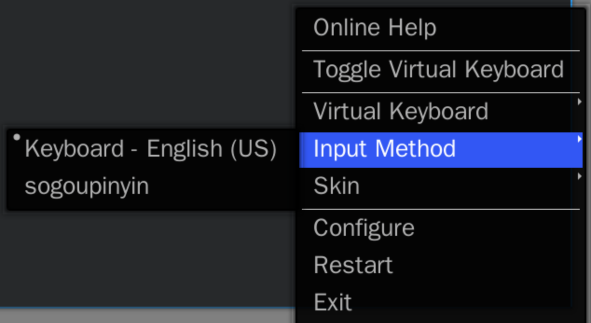
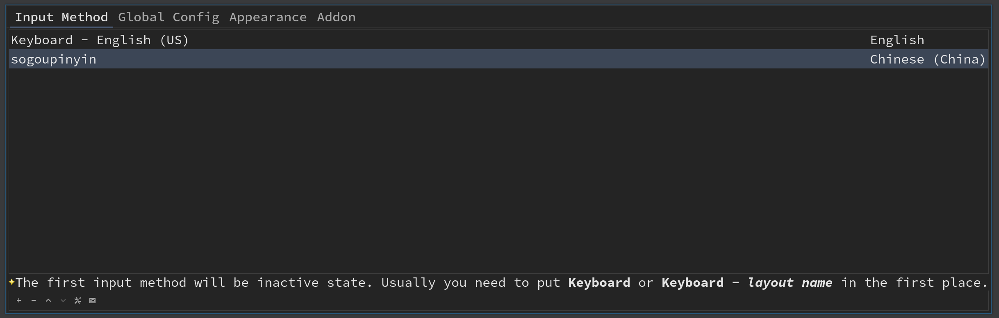
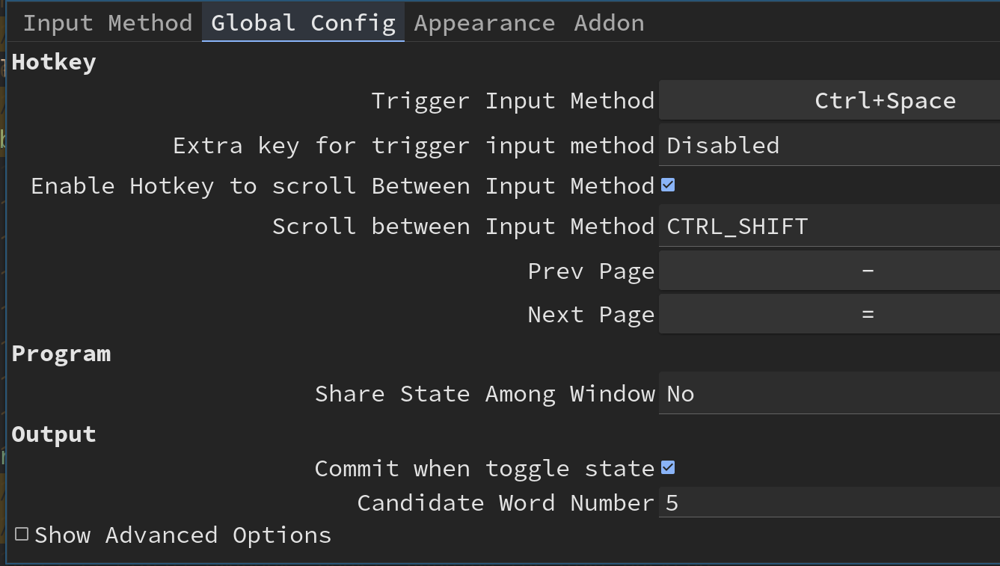

# Support chinese

- Install chinese input method

    ```bash
    # `fcitx-table-extra` includes `WuBi` and `WuBiPinYin`
    sudo pacman -S fcitx fcitx-im fcitx-configtool fcitx-table-extra

    # SouGou PinYin (it inclues WuBi)
    yay -S fcitx-sogoupinyin
    ```

    After finishing, it will create an auto start desktop link in here:
    
    `/etc/xdg/autostart/fcitx-autostart.desktop`

</br>

- Add input method configuration file

    Put the following settings into `~/.xprofile`:

    ```bash
    export GTK_IM_MODULE=fcitx
    export QT_IM_MODULE=fcitx
    export XMODIFIERS="@im=fcitx"
    ```

</br>

- Auto start `fcitx` in your `i3` configuration

    `vim ~/.config/i3/config` and add the following settings:

    ```bash
    # Load chinese input method
    exec_always fcitx
    ```

    Make sure you reboot to take affect, or you can reboot after installing
    chinese fonts below.

</br>

- Install chinese fonts

    ```bash
    yay -S wqy-bitmapfont wqy-microhei \
        wqy-microhei-lite \
        wqy-zenhei \
        adobe-source-han-mono-cn-fonts \
        adobe-source-han-sans-cn-fonts \
        adobe-source-han-serif-cn-fonts
    ```

    Your browser needs to restart to take affect.

</br>

- The default shortcuts 
    - `Ctrl+Space`: Trigger input method. If you only install single input 
    method (`fcitx-sogoupinyin`), then it works like toggle chinese input method.

    - `Shirt+Ctrl+f`: Switch between `Traditional Chinese` and `Simplified Chinese`.

</br>

- About the configuration

    After rebooting, you should be able to see the `fcixt-configtool` icon shows on the bottom-right of your screen.
    Click on it, it will show a menu like below:

    

    Click on `configure`, then you will see the configuration UI below:

    

    
