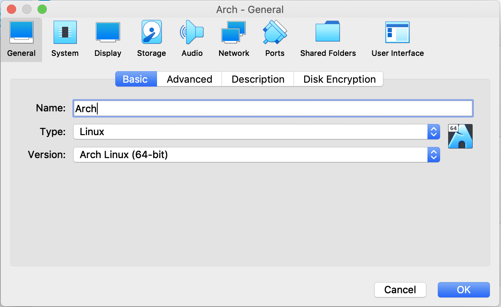
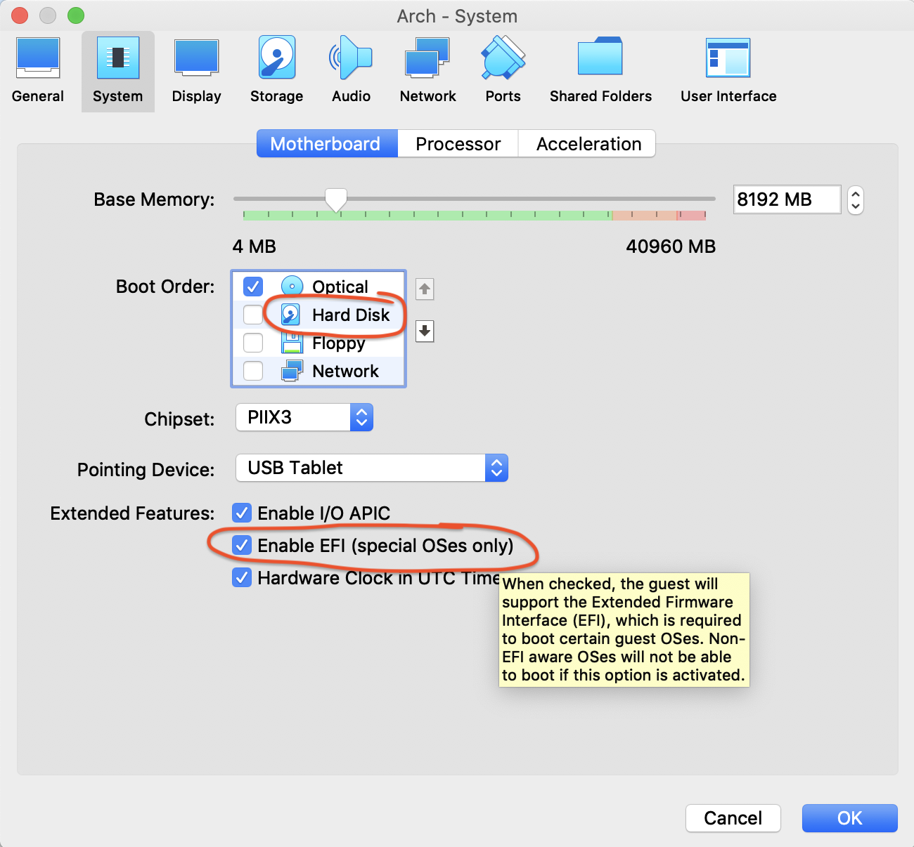
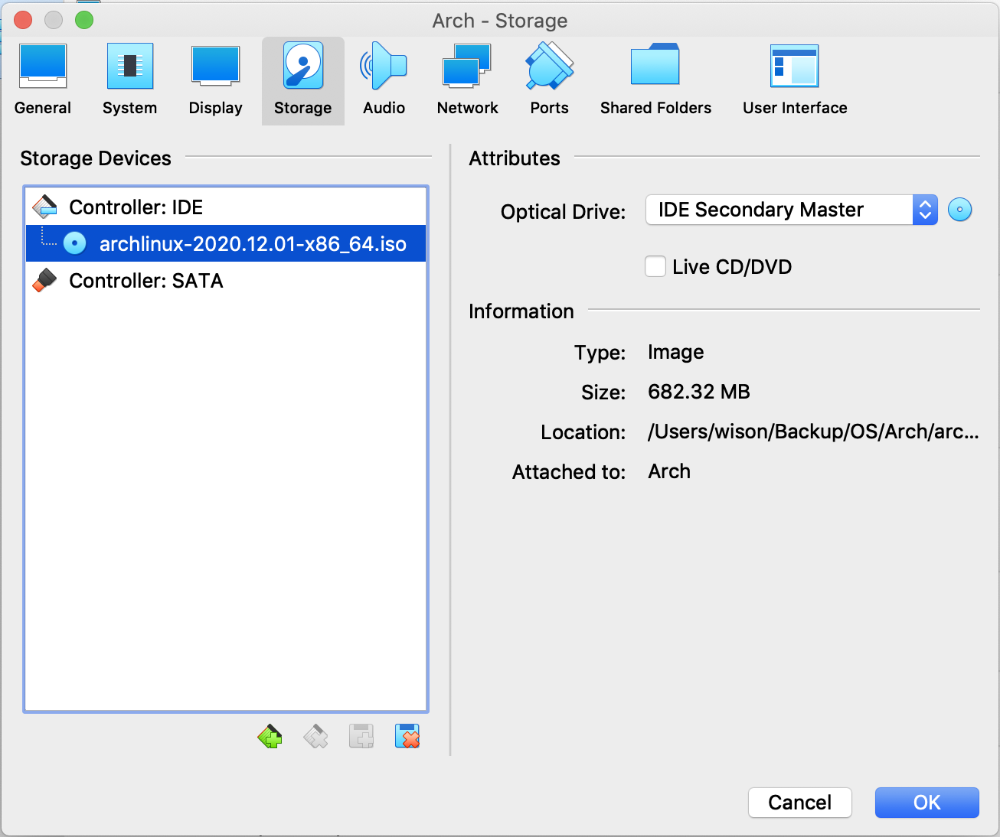
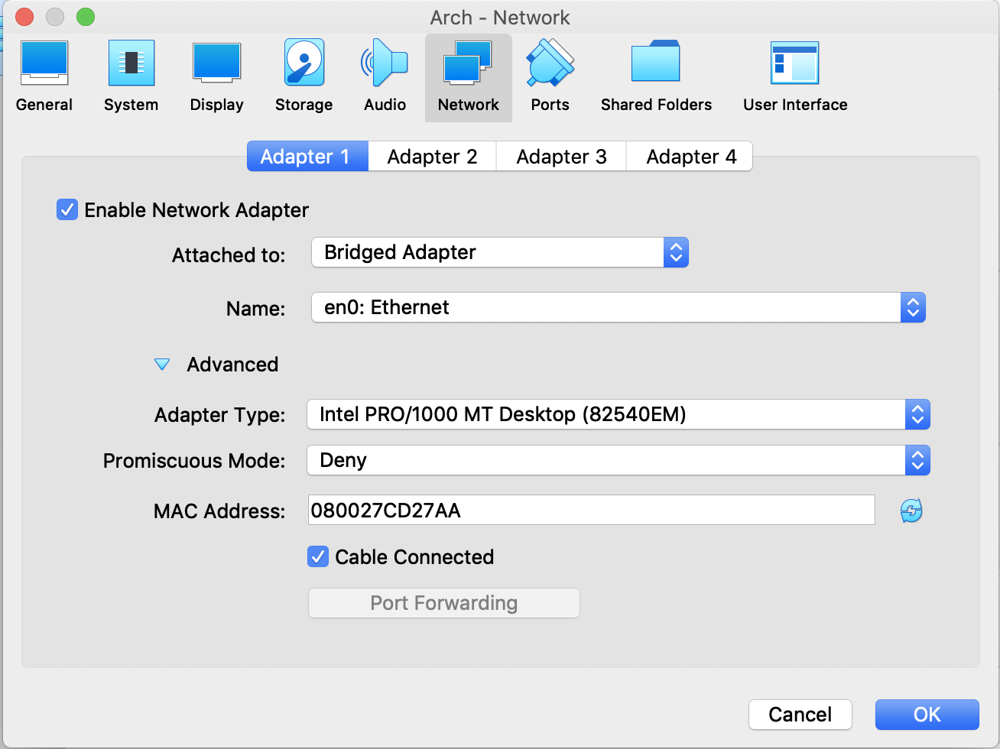
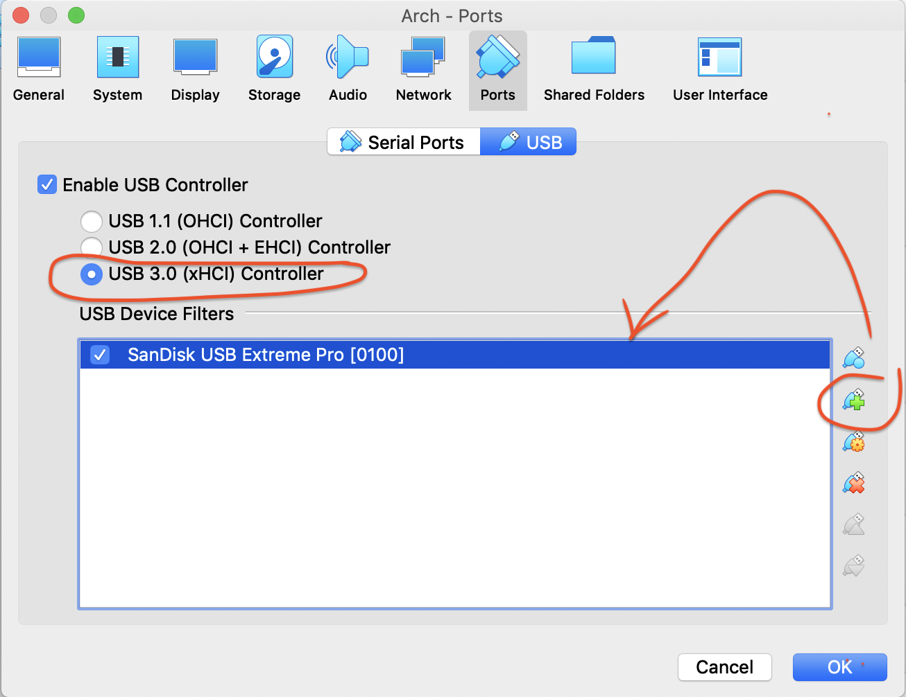
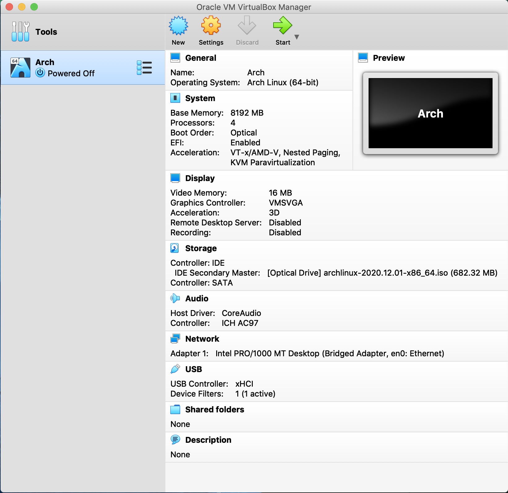
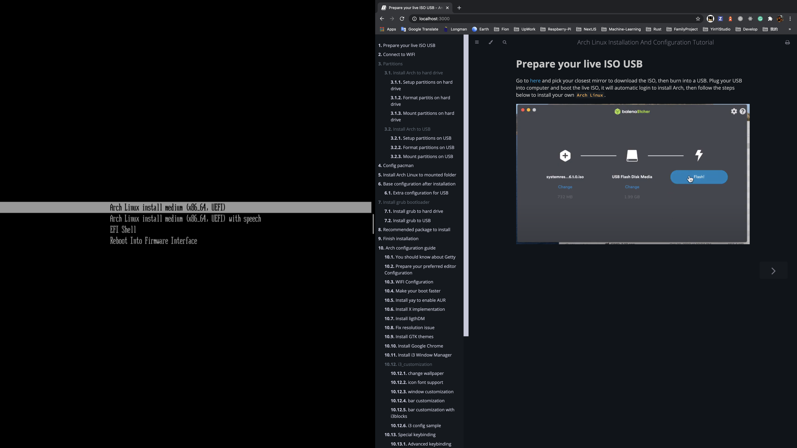
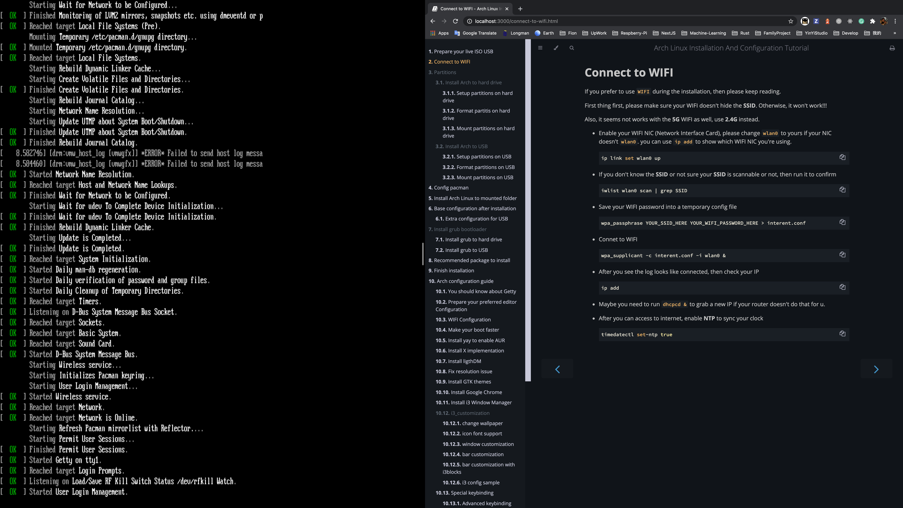
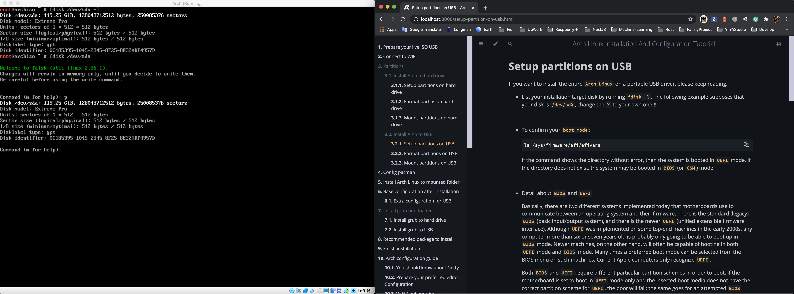

# Use `VirtualBox` to boot live ISO

Actually, you can run the installation process inside `VirutalBox`. Here is the step-by-step walk through:

 

As you boot from the live ISO, so you don't any harddrive at all.

And make sure check the `Enable EFI`!!!

 

 

 

If you want to install to USB, add your USB here:

 

Now, you can run the virtual machine:

 

Of course, you can open this book side-by-side which is more easy to walk through step-by-step

 

 

 

